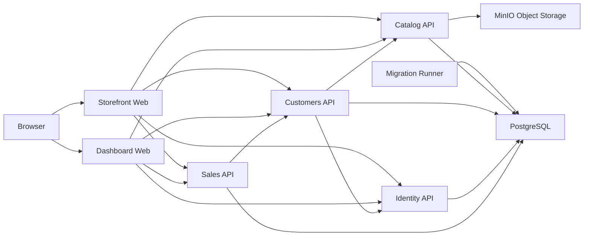

# Matterway Platform

> A commerce platform for browsing products, managing customer accounts, and operating catalog, order, and payment workflows.

Matterway combines a customer storefront, an internal admin dashboard, and service-owned APIs for catalog, customers, identity, and sales. It runs on .NET 10 with PostgreSQL, MinIO, Nuxt 4, and .NET Aspire.

## Overview

Storefront.Web handles shopping and checkout. Dashboard.Web handles catalog and administrative workflows. Both use Nuxt server proxy routes to reach the backend APIs.

## Architecture



## Routing Model

Internal API routes follow:

- `/api/public/v1/...`
- `/api/self/v1/...`
- `/api/admin/v1/...`
- `/api/system/v1/...`

Browser-facing requests use the same-origin proxy routes exposed by the Nuxt apps:

- `/api/<service>/<scope>/v1/...`
- The Nuxt server forwards those requests to the internal API base URL injected by AppHost through `NUXT_SERVER_*`.
- Storefront-owned orchestration and webhook routes live under `/api/storefront/...`.

Examples:

- `/api/identity/public/v1/auth`
- `/api/catalog/public/v1/articles`
- `/api/catalog/public/v1/images/<id>`
- `/api/storefront/checkout`
- `/api/storefront/webhooks/stripe`

This keeps backend ports and CORS setup out of browser-facing code.

## Authentication

- Identity.Api issues JWT access and refresh tokens
- System-to-system endpoints can require `X-System-Access-Key`
- Authorization is enforced through role and permission claims

## Repository Layout

```text
src/
  Matterway.AppHost/          Aspire orchestration and composition root
  Matterway.ServiceDefaults/  Shared platform defaults
  Matterway.Catalog.Api/      Catalog domain and MinIO integration
  Matterway.Customers.Api/    Customer domain
  Matterway.Identity.Api/     Authentication and JWT service
  Matterway.Migrations/       EF Core migration runner
  Matterway.Sales.Api/        Sales domain
  Matterway.Storefront.Web/   Nuxt customer application
  Matterway.Dashboard.Web/    Nuxt admin application

scripts/                      Database, migration, and Docker Hub helpers
data/                         Local artifacts such as catalog archives
docs/                         Supporting diagrams and assets
```

## Default Development Ports

| Component        | Port  | Responsibility                               |
|------------------|-------|----------------------------------------------|
| Catalog.Api      | 2001  | Articles, pricing, discounts, images         |
| Customers.Api    | 2002  | Profiles, addresses, carts, order mirror     |
| Identity.Api     | 2003  | Authentication, token issuance, permissions  |
| Sales.Api        | 2005  | Orders, payments, status tracking            |
| Storefront.Web   | 3001  | Customer SSR app                             |
| Dashboard.Web    | 3002  | Admin SSR app                                |
| PostgreSQL       | 15432 | Relational datastore                         |
| MinIO API        | 19000 | Object storage API                           |
| MinIO Console    | 19001 | Storage admin console                        |
| Aspire Dashboard | 18888 | Local orchestration and telemetry            |

## Local Development

### Prerequisites

- Docker
- .NET SDK 10.x
- Node.js 20+
- dotnet-ef tool
- Aspire CLI
- Stripe CLI for webhook testing

### Restore

```bash
dotnet restore Matterway.slnx
npm install --prefix src/Matterway.Storefront.Web
npm install --prefix src/Matterway.Dashboard.Web
```

### Configure AppHost

AppHost reads topology values from:

- `src/Matterway.AppHost/appsettings.json`
- `src/Matterway.AppHost/appsettings.Development.json`
- `src/Matterway.AppHost/appsettings.Production.json`

Set secret parameters with user-secrets:

```bash
dotnet user-secrets set "Parameters:JwtSigningKey" "<value>" --project src/Matterway.AppHost
dotnet user-secrets set "Parameters:SystemAccessKey" "<value>" --project src/Matterway.AppHost
dotnet user-secrets set "Parameters:PostgresPassword" "<value>" --project src/Matterway.AppHost
dotnet user-secrets set "Parameters:MinioRootUser" "<value>" --project src/Matterway.AppHost
dotnet user-secrets set "Parameters:MinioRootPassword" "<value>" --project src/Matterway.AppHost
dotnet user-secrets set "Parameters:StripeSecretKey" "<value>" --project src/Matterway.AppHost
```

Required non-secret topology keys:

- `Services:AspireDashboard:*`
- `Services:Postgres:*`
- `Services:Minio:*`
- `Services:Storefront:*`
- `Services:Dashboard:*`

Runtime notes:

- AppHost injects `NUXT_SERVER_IDENTITY_API_BASE_URL`, `NUXT_SERVER_CATALOG_API_BASE_URL`, `NUXT_SERVER_CUSTOMERS_API_BASE_URL`, and `NUXT_SERVER_SALES_API_BASE_URL` into the Nuxt apps.
- Storefront.Web also receives `NUXT_SYSTEM_ACCESS_KEY` and `NUXT_STRIPE_SECRET_KEY`.
- Browser-facing public service URLs are no longer needed.
- Browser-side CORS setup is no longer needed.
- API projects still need `Security:SystemAccessKey` for standalone runs.
- `Matterway.Catalog.Api` image storage uses `ImageStorage:*` settings; AppHost wires these for the stack.

### Run the Stack

```bash
dotnet run --project src/Matterway.AppHost
```

Useful commands:

```bash
./scripts/databases help
./scripts/databases update
./scripts/migrations help
./scripts/migrations add
./scripts/dockerhub help
./scripts/dockerhub push help
```

```bash
stripe listen --forward-to http://localhost:3001/api/storefront/webhooks/stripe
```

## Deployment

```bash
aspire deploy --environment Production
```

In non-dev deployments, only the `.Web` projects are exposed externally. Backend APIs stay internal and are reached through the Nuxt server proxy routes.

To retag and push the compose-built images, use the Docker Hub helper:

```bash
./scripts/dockerhub push <source-tag> [dest-tag] [namespace]
```

## Database

- `Matterway.Migrations` handles runtime schema updates
- `./scripts/databases update` applies local migrations
- `./scripts/databases drop` removes local databases
- `./scripts/migrations add` creates the `Initialize` migration across API projects
- `./scripts/migrations remove` removes the latest migration across API projects

## Observability

- OpenTelemetry instrumentation
- Resilient HttpClient defaults
- ProblemDetails standardization
- OpenAPI generation

Storefront Web has server-side OTEL tracing. Dashboard Web currently does not.

## Documentation

- `docs/` contains diagrams and supporting assets

## License

MIT License. See `LICENSE.txt`.
