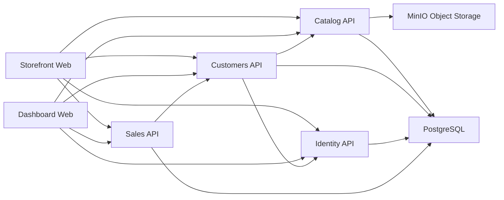

# Matterway Platform

Matterway is a full-stack commerce platform built as a .NET microservice backend with two Nuxt web clients:

- `Storefront.Web`: customer-facing shopping experience.
- `Dashboard.Web`: internal ERP/admin console.

The backend is organized around service ownership boundaries (Catalog, Customers, Identity, Sales), with shared API conventions in `Matterway.ServiceDefaults` and orchestration through `.NET Aspire` (`Matterway.AppHost`).

## Architecture Overview



## Core Design Decisions

- Backend style: Minimal APIs with a feature-first layout (`Endpoints/<Scope>/<Endpoint>`).
- Routing convention: `/api/{public|self|admin|system}/v{version}/...`.
- API versioning: URL segment versioning (currently `v1.0`).
- Authn/Authz: JWT bearer authentication with role + permission-claim checks.
- Data ownership: each service owns its persistence model and schema.
- Cross-service calls: typed HTTP clients with service discovery fallback.
- Storage split:
  - relational data in PostgreSQL
  - catalog media in MinIO (S3-compatible)

## Services and Ports (AppHost Defaults)

| Component | Port | Responsibility |
| --- | --- | --- |
| `Catalog.Api` | `2001` | Articles, details, discounts, image metadata, catalog archive import/export |
| `Customers.Api` | `2002` | Customer profiles, addresses, carts, customer order mirror |
| `Identity.Api` | `2003` | Authentication, token refresh, user/permission management |
| `Sales.Api` | `2005` | Order lifecycle, payment records, status tracking |
| `Storefront.Web` | `3001` | Customer SPA (Nuxt 4) |
| `Dashboard.Web` | `3002` | Admin/employee SPA (Nuxt 4) |
| PostgreSQL | `15432` | Primary datastore for all APIs (separate DB per service) |
| MinIO API | `19000` | S3-compatible object API |
| MinIO Console | `19001` | MinIO admin console |
| Aspire Dashboard | `18888` | Local orchestration/telemetry dashboard |

## Repository Structure

```text
src/
  Matterway.AppHost/          # Aspire composition: services, ports, infra containers, env wiring
  Matterway.ServiceDefaults/  # Shared API bootstrap, auth, versioning, OpenAPI, CORS, telemetry
  Matterway.Catalog.Api/      # Catalog domain and media integration (MinIO)
  Matterway.Customers.Api/    # Customer domain and brokers to Catalog/Identity
  Matterway.Identity.Api/     # ASP.NET Identity + JWT token service
  Matterway.Sales.Api/        # Sales domain and broker to Customers
  Matterway.Storefront.Web/   # Nuxt customer app (+ Stripe server handlers)
  Matterway.Dashboard.Web/    # Nuxt admin dashboard
scripts/                      # EF migration + DB lifecycle scripts
data/                         # Local data artifacts (catalog archives, etc.)
docs/                         # PlantUML high-level design artifacts
```

## API Conventions

- Base route pattern:
  - `/api/public/v1.0/...`
  - `/api/self/v1.0/...`
  - `/api/admin/v1.0/...`
  - `/api/system/v1.0/...`
- OpenAPI document (development): `/openapi/v1.yaml`
- Unified Scalar API Reference (development): Aspire `scalar-api-reference` resource in `Matterway.AppHost`
- Health endpoints (development): `/health`, `/alive`

Scope semantics:

- `public`: anonymous/public endpoints.
- `self`: authenticated user acting on own resources.
- `admin`: employee/operator/administrator workflows.
- `system`: trusted service-to-service endpoints.

## Authentication and Authorization Model

- Identity service issues JWT access and refresh tokens.
- `Customer` users access storefront self workflows.
- `Employee` users use permission claims (`perm`) with levels:
  - `observer`
  - `operator`
  - `administrator`
- Service endpoints enforce permission level checks with shared helpers in `Matterway.ServiceDefaults`.

## Local Development

### Prerequisites

- Docker Desktop (or Docker Engine) for PostgreSQL and MinIO.
- .NET SDK `10.0.100` (see `global.json`).
- Node.js compatible with Nuxt 4 (Node 20+ recommended).
- `dotnet-ef` tool (required for migration/database scripts):

```bash
dotnet tool install --global dotnet-ef
```

### 1) Restore Dependencies

```bash
dotnet restore Matterway.slnx
npm install --prefix src/Matterway.Storefront.Web
npm install --prefix src/Matterway.Dashboard.Web
```

### 2) Configure AppHost Parameters

`Matterway.AppHost` expects these parameters:

- `Parameters:JwtSigningKey`
- `Parameters:PostgresPassword`
- `Parameters:MinioRootUser`
- `Parameters:MinioRootPassword`

Set them with user-secrets:

```bash
dotnet user-secrets set "Parameters:JwtSigningKey" "<jwt-signing-key>" --project src/Matterway.AppHost
dotnet user-secrets set "Parameters:PostgresPassword" "<postgres-password>" --project src/Matterway.AppHost
dotnet user-secrets set "Parameters:MinioRootUser" "<minio-user>" --project src/Matterway.AppHost
dotnet user-secrets set "Parameters:MinioRootPassword" "<minio-password>" --project src/Matterway.AppHost
```

### 3) Start Full Stack (Recommended)

```bash
dotnet run --project src/Matterway.AppHost
```

This starts APIs, both Nuxt apps, PostgreSQL, MinIO, and Aspire dashboard using the ports listed above.

### 4) Apply Migrations

APIs do not auto-run EF migrations on startup. Run this once after PostgreSQL is up:

```bash
./scripts/databases_update.sh
```

Windows equivalent:

```cmd
scripts\databases_update.cmd
```

## Manual Run Mode (Without AppHost)

Use this when debugging one service at a time.

Backend services:

```bash
dotnet watch run --project src/Matterway.Catalog.Api
dotnet watch run --project src/Matterway.Customers.Api
dotnet watch run --project src/Matterway.Identity.Api
dotnet watch run --project src/Matterway.Sales.Api
```

Web clients:

```bash
PORT=3001 npm run dev --prefix src/Matterway.Storefront.Web
PORT=3002 npm run dev --prefix src/Matterway.Dashboard.Web
```

When running web apps outside AppHost, provide API base URLs via env vars:

- Storefront:
  - `CATALOG_API_BASE_URL`
  - `CUSTOMERS_API_BASE_URL`
  - `AUTH_API_BASE_URL` or `IDENTITY_API_BASE_URL`
  - `SALES_API_BASE_URL`
  - `SERVER_SALES_API_BASE_URL` (for Stripe webhook-to-sales flow)
  - `STRIPE_SECRET_KEY` (if using payment endpoints)
- Dashboard:
  - `IDENTITY_API_BASE_URL`
  - `CATALOG_API_BASE_URL`
  - `CUSTOMERS_API_BASE_URL`
  - `SALES_API_BASE_URL`

## Database and Migration Workflow

Scripts are provided for all `*.Api` projects:

- `./scripts/migrations_add.sh`
- `./scripts/migrations_remove.sh`
- `./scripts/databases_update.sh`
- `./scripts/databases_drop.sh`

Windows equivalents exist with `.cmd` extension.

Typical reset flow:

```bash
./scripts/databases_drop.sh
./scripts/databases_update.sh
```

## Observability and Platform Defaults

`Matterway.ServiceDefaults` provides:

- OpenTelemetry instrumentation (ASP.NET Core, HttpClient, runtime).
- service discovery and resilient `HttpClient` defaults.
- shared error handling and problem details shaping.
- API versioning and OpenAPI document generation.
- shared auth/cors bootstrapping.

## Notes on Demo Data

- Catalog, customers, and identity services include seeded data in their EF model configuration.
- Catalog images are stored in MinIO and can be imported/exported through catalog archive endpoints.

## Documentation Assets

- `docs/Matterway HLD: Class Diagram - Platform Overview.puml`
- `docs/Matterway HLD: Sequence Diagram - Storefront Checkout Place Order.puml`

## License

MIT License. See `LICENSE.txt`.
