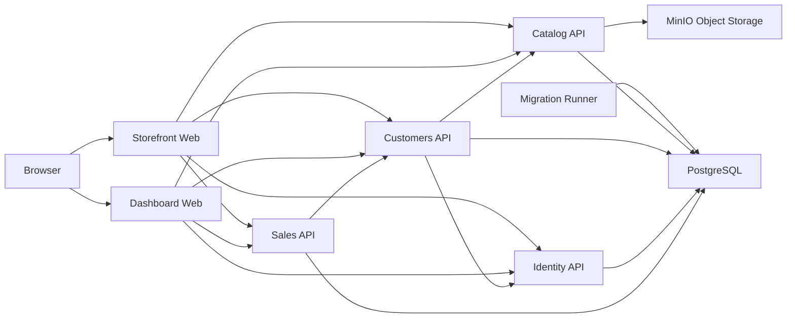

# Matterway Platform

> A commerce platform for browsing products, managing customer accounts, and operating catalog, order, and payment workflows.

Matterway combines a customer storefront, an internal administration dashboard, and service-owned APIs for catalog, customers, identity, and sales. The stack uses .NET 10, PostgreSQL, MinIO, Nuxt 4, and Aspire.

## Architecture

The Storefront and Dashboard are the only browser-facing applications. Their Nuxt server routes proxy requests to the internal APIs and orchestrate flows such as checkout.



### Routing

Backend API routes use these scopes:

- `/api/public/v1/...`
- `/api/self/v1/...`
- `/api/admin/v1/...`
- `/api/system/v1/...`

Browser requests use same-origin Nuxt routes such as `/api/<service>/<scope>/v1/...`. AppHost injects the internal service addresses through `NUXT_SERVER_*`, so browser code does not need backend ports or CORS configuration.

Storefront-owned routes live under `/api/storefront/...`, including checkout and Stripe webhooks. Image requests use `/api/storefront/cdn/images/<id>` or `/api/dashboard/cdn/images/<id>`.

### Authentication

- Identity.Api issues JWT access and refresh tokens.
- Role and permission claims control user access.
- Internal system endpoints can additionally require `X-System-Access-Key`.

## Repository Layout

```text
src/
  Matterway.AppHost/          Aspire orchestration and composition root
  Matterway.ServiceDefaults/  Shared platform defaults
  Matterway.Catalog.Api/      Catalog domain and MinIO integration
  Matterway.Customers.Api/    Customer domain
  Matterway.Identity.Api/     Authentication and JWT service
  Matterway.Migrations/       EF Core migration runner
  Matterway.Sales.Api/        Sales domain
  Matterway.Storefront.Web/   Nuxt customer application
  Matterway.Dashboard.Web/    Nuxt administration application

scripts/                      Development and deployment helpers
data/                         Local artifacts such as catalog archives
docs/                         Diagrams and supporting assets
```

## Local Development

### Prerequisites

- Docker
- .NET SDK 10.x
- Node.js 20+
- Aspire CLI
- `dotnet-ef` tool
- Stripe CLI, only for webhook testing

### Install Dependencies

```bash
dotnet restore Matterway.slnx
npm install --prefix src/Matterway.Storefront.Web
npm install --prefix src/Matterway.Dashboard.Web
```

### Configure AppHost

Versioned topology settings are in `src/Matterway.AppHost/appsettings*.json`. Store secrets outside the repository:

```bash
dotnet user-secrets set "Parameters:JwtSigningKey" "<value>" --project src/Matterway.AppHost
dotnet user-secrets set "Parameters:SystemAccessKey" "<value>" --project src/Matterway.AppHost
dotnet user-secrets set "Parameters:PostgresPassword" "<value>" --project src/Matterway.AppHost
dotnet user-secrets set "Parameters:MinioRootUser" "<value>" --project src/Matterway.AppHost
dotnet user-secrets set "Parameters:MinioRootPassword" "<value>" --project src/Matterway.AppHost
dotnet user-secrets set "Parameters:StripeSecretKey" "<value>" --project src/Matterway.AppHost
```

Required topology sections are `Services:AspireDashboard`, `Services:Postgres`, `Services:Minio`, `Services:Storefront`, and `Services:Dashboard`.

API projects keep `appsettings*.json` in their project roots for standalone local runs. These files are excluded from publish output; AppHost supplies deployment settings and secrets as environment variables. Catalog image storage uses `ImageStorage:*`, which AppHost wires to MinIO.

### Run

`aspire.config.json` selects the AppHost and enables watch mode, so the normal development command is:

```bash
aspire run
```

For a background session:

```bash
aspire start
aspire ps
aspire stop
```

### Default Development Endpoints

| Component        | Port  | Responsibility                              |
|------------------|-------|---------------------------------------------|
| Catalog.Api      | 2001  | Articles, pricing, discounts, images        |
| Customers.Api    | 2002  | Profiles, addresses, carts, order mirror    |
| Identity.Api     | 2003  | Authentication, tokens, permissions         |
| Sales.Api        | 2004  | Orders, payments, status tracking           |
| Storefront.Web   | 4001  | Customer SSR application                    |
| Dashboard.Web    | 4002  | Administration SSR application              |
| PostgreSQL       | 15432 | Relational datastore                        |
| MinIO API        | 19000 | Object storage API                          |
| MinIO Console    | 19001 | Object storage administration               |
| Matterway Aspire | 18888 | Local orchestration and telemetry           |
| Scalar           | 18889 | Unified API reference                       |

### Test Stripe Webhooks

```bash
stripe listen --forward-to http://localhost:4001/api/storefront/webhooks/stripe
```

## Database and Migrations

`Matterway.Migrations` applies all four service schemas during an Aspire-managed start or deployment. The repository helpers are for direct local maintenance:

| Task | Command |
|------|---------|
| Apply all migrations | `./scripts/databases update` |
| Drop all local databases | `./scripts/databases drop` |
| Add each service's `Initialize` migration | `./scripts/migrations add` |
| Remove each service's latest migration | `./scripts/migrations remove` |
| Show helper usage | `./scripts/databases help` or `./scripts/migrations help` |

## Deployment

```bash
aspire deploy
```

The default deployment environment is `Production`. Use `--environment <name>` only for another named deployment environment.

Aspire generates the Docker Compose deployment and container images. It builds and packages the Nuxt servers from their package scripts, while the .NET SDK builds the APIs and migration runner; no project-level Dockerfiles are required.

Only Storefront.Web and Dashboard.Web have public HTTP endpoints in publish mode. The APIs, PostgreSQL, MinIO, and migration runner remain internal to the generated composition.

To retag and push the generated application images:

```bash
./scripts/dockerhub push <source-tag> [dest-tag] [namespace]
```

Run `./scripts/dockerhub help` for examples and defaults.

## Observability

The platform configures OpenTelemetry, resilient `HttpClient` defaults, standardized ProblemDetails responses, and OpenAPI generation. Storefront.Web exports server-side traces; Dashboard.Web currently does not.

## Documentation

See [`docs/README.md`](docs/README.md) for the editable PlantUML sources and rendered diagrams.

## License

MIT License. See [`LICENSE.txt`](LICENSE.txt).
