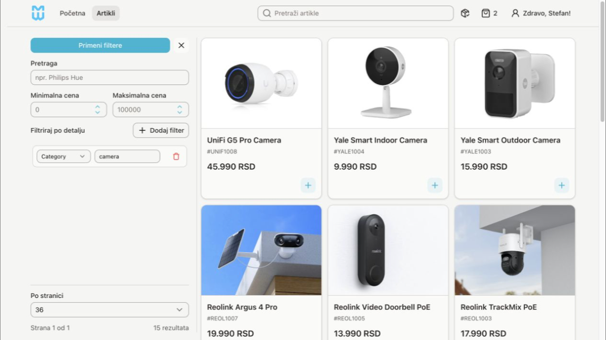
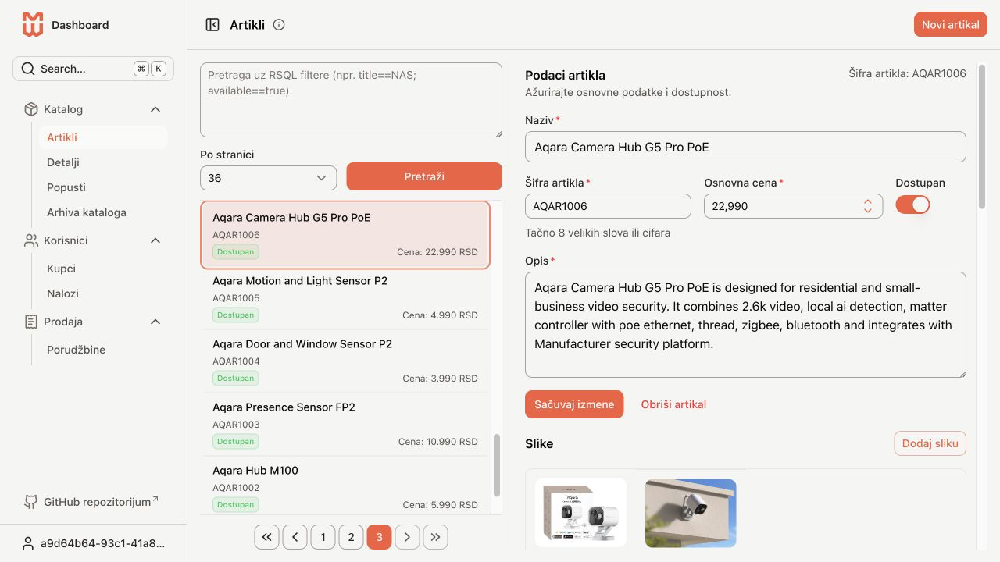
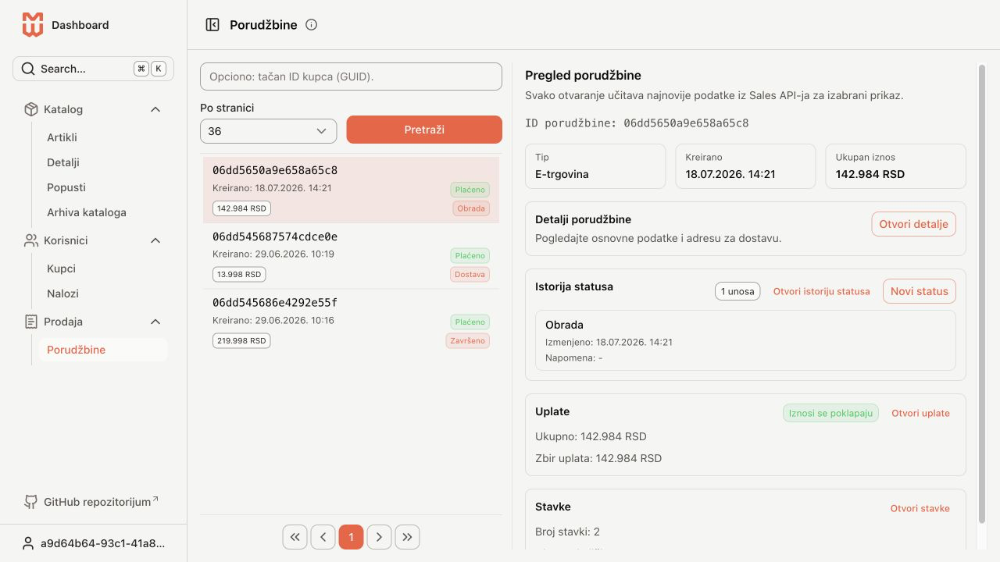
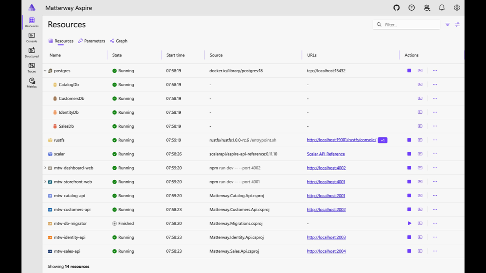
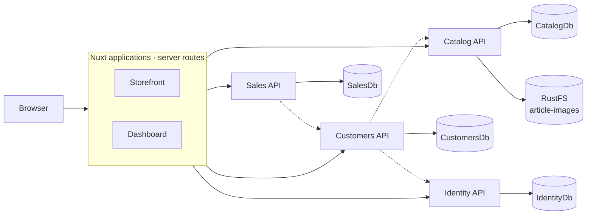

# Matterway

Matterway is a commerce platform with a customer storefront, an administration dashboard, and four APIs for catalog, customer, identity, and sales workflows.

- **Storefront:** product browsing, customer accounts, carts, checkout, and Stripe payments.
- **Dashboard:** articles, product details, discounts, catalog archives, customer accounts, and orders.
- **Backend:** ASP.NET Core APIs, PostgreSQL databases, and RustFS object storage, started together through Aspire.

The stack uses .NET 10, Nuxt 4, Vue 3, Nuxt UI, PostgreSQL 18, and RustFS. Catalog accesses RustFS through the AWS S3 SDK; an AWS account is not required.

[Preview](#preview) · [Get started](#get-started) · [Architecture](#architecture) · [Development](#development) · [Image storage](#image-storage) · [Deployment](#deployment) · [Troubleshooting](#troubleshooting)

## Preview

| Storefront | Catalog administration |
| --- | --- |
|  |  |
| Browse products and filter by price and technical details. | Manage articles, product images, prices, and availability. |

| Order administration | Aspire dashboard |
| --- | --- |
|  |  |
| Review order items, payments, and status history. | Inspect services, infrastructure, and resource health. |

## Get started

Run the commands below from the repository root.

### 1. Install prerequisites

| Tool | Requirement |
| --- | --- |
| .NET SDK | .NET 10; see [`global.json`](global.json) for SDK resolution settings |
| Node.js and npm | Node 22.12+ within the 22.x line, or Node 24.11+ within the 24.x line, satisfies both web app lockfiles |
| Docker | A running Docker engine for PostgreSQL and RustFS |
| Aspire CLI | Starts and deploys the application defined by AppHost |

The `dotnet-ef` tool is needed for manual database maintenance. The Stripe CLI is needed only for local webhook forwarding.

### 2. Restore dependencies

```bash
dotnet restore Matterway.slnx
npm ci --prefix src/Matterway.Storefront.Web
npm ci --prefix src/Matterway.Dashboard.Web
```

### 3. Configure local secrets

AppHost passes credentials to the services it starts. Replace the placeholders below and store the values in .NET user secrets:

```bash
dotnet user-secrets set "Parameters:JwtSigningKey" "<random-signing-key>" --project src/Matterway.AppHost
dotnet user-secrets set "Parameters:SystemAccessKey" "<random-service-key>" --project src/Matterway.AppHost
dotnet user-secrets set "Parameters:PostgresPassword" "<database-password>" --project src/Matterway.AppHost
dotnet user-secrets set "Parameters:RustFSAccessKey" "matterway-local" --project src/Matterway.AppHost
dotnet user-secrets set "Parameters:RustFSSecretKey" "<storage-secret>" --project src/Matterway.AppHost
dotnet user-secrets set "Parameters:StripeSecretKey" "<stripe-test-secret-key>" --project src/Matterway.AppHost
```

Use at least 32 random ASCII characters for the JWT signing key. The RustFS access key must not contain `/`, and its secret key must contain at least eight characters. Use a Stripe test-mode secret key for local checkout.

### 4. Start the application

Start Docker, then run:

```bash
aspire run
```

[`aspire.config.json`](aspire.config.json) selects AppHost and enables watch mode. AppHost starts the infrastructure, runs migrations for all four databases, and supplies service addresses to the APIs and web apps. Catalog also waits for RustFS readiness before initializing its image bucket.

Open the Aspire dashboard URL printed in the terminal to inspect resource status, logs, and traces.

### Local addresses

| Service | Address | Purpose |
| --- | --- | --- |
| Storefront | [localhost:4001](http://localhost:4001) | Customer application |
| Dashboard | [localhost:4002](http://localhost:4002) | Administration application |
| Scalar | [localhost:18889](http://localhost:18889) | Combined API reference |
| Aspire | Port `18888`; use the terminal link | Resource status and telemetry |
| RustFS console | [localhost:19001/rustfs/console/](http://localhost:19001/rustfs/console/) | Buckets and objects |
| RustFS S3 API | `http://localhost:19000` | Object storage endpoint |
| Catalog API | `http://localhost:2001` | Articles, details, discounts, and images |
| Customers API | `http://localhost:2002` | Customer profiles, addresses, and carts |
| Identity API | `http://localhost:2003` | Authentication and permissions |
| Sales API | `http://localhost:2004` | Orders and payments |
| PostgreSQL | `localhost:15432` | Four service-owned databases |

## Architecture

Browser requests go through the Nuxt server routes in Storefront or Dashboard. These routes forward requests to the APIs and coordinate workflows such as checkout. Each API owns its database; Catalog also stores image objects in RustFS.



Both Nuxt applications call all four APIs. Dashed arrows show service-to-service calls: Sales calls Customers, and Customers calls Catalog and Identity.

### Routes and authentication

API routes are grouped under `/api/public/v1`, `/api/self/v1`, `/api/admin/v1`, and `/api/system/v1`. Browser clients use same-origin Nuxt routes such as `/api/<service>/<scope>/v1/...`. AppHost supplies internal addresses through `NUXT_SERVER_*` environment variables.

Identity issues access and refresh JWTs. APIs enforce role and permission claims; system endpoints can also require `X-System-Access-Key`.

Storefront-owned workflows use `/api/storefront/...`. Image requests go through `/api/storefront/cdn/images/<id>` or `/api/dashboard/cdn/images/<id>`.

### Repository layout

```text
src/
  Matterway.AppHost/          Aspire orchestration and deployment
  Matterway.ServiceDefaults/  Shared API, telemetry, and hosting defaults
  Matterway.Catalog.Api/      Catalog, images, and archive import/export
  Matterway.Customers.Api/    Customers, addresses, and carts
  Matterway.Identity.Api/     Authentication, users, and permissions
  Matterway.Sales.Api/        Orders and payments
  Matterway.Migrations/       Migration runner for all four databases
  Matterway.Storefront.Web/   Customer-facing Nuxt application
  Matterway.Dashboard.Web/    Administration Nuxt application
scripts/                     Database, migration, and image-publishing helpers
data/                        Local artifacts, including catalog archives
docs/                        Diagrams, screenshots, and supporting documents
```

See [`docs/README.md`](docs/README.md) for diagram sources and export instructions.

## Development

### Start and stop a background session

```bash
aspire start
aspire ps
aspire stop
```

### Check changes

```bash
dotnet build Matterway.slnx

npm run typecheck --prefix src/Matterway.Storefront.Web
npm run lint --prefix src/Matterway.Storefront.Web
npm run build --prefix src/Matterway.Storefront.Web

npm run typecheck --prefix src/Matterway.Dashboard.Web
npm run lint --prefix src/Matterway.Dashboard.Web
npm run build --prefix src/Matterway.Dashboard.Web
```

These commands check compilation, types, lint rules, and production web builds. They do not exercise checkout or other complete user flows.

### Configuration

- **Ports:** [`src/Matterway.AppHost/appsettings.json`](src/Matterway.AppHost/appsettings.json) defines `Services:AspireDashboard`, `Services:Scalar`, `Services:Postgres`, `Services:RustFS`, `Services:Storefront`, and `Services:Dashboard`. API development ports are in each API's `Properties/launchSettings.json`.
- **Local credentials:** use AppHost user secrets from the setup instructions.
- **Standalone API runs:** each API has its own `appsettings*.json`. Configure its database, authentication, and service dependencies when running it outside AppHost.
- **Deployment:** API `appsettings*.json` files are excluded from publish output. AppHost supplies the deployment configuration through environment variables.

### Database maintenance

The migration runner applies existing migrations during an Aspire-managed startup. For manual maintenance, install `dotnet-ef` and configure the API projects to reach the intended databases.

| Task | Command |
| --- | --- |
| Apply migrations to all API databases | `./scripts/databases update` |
| Drop all API databases, without confirmation | `./scripts/databases drop` |
| Add an `Initialize` migration to every API | `./scripts/migrations add` |
| Remove the latest migration from every API | `./scripts/migrations remove` |

The helpers operate on **all four APIs**. For a named migration in one service, use `dotnet ef migrations add <name> --project src/Matterway.Catalog.Api`, substituting the relevant project. Windows command-prompt equivalents are available as `.cmd` files in `scripts/`.

### Stripe webhooks

With Storefront running and a Stripe test key configured, forward events to the local handler:

```bash
stripe listen --forward-to http://localhost:4001/api/storefront/webhooks/stripe
```

The handler processes `charge.succeeded` events to register payments with Sales.

## Image storage

AppHost runs the pinned `rustfs/rustfs:1.0.0-rc.6` image. This is a release candidate; test upgrades before changing the tag.

Sign in to the [RustFS console](http://localhost:19001/rustfs/console/) with the configured access and secret keys. Catalog creates the `article-images` bucket automatically and grants anonymous reads for its `images/*` prefix. Objects use keys of the form `images/<image-id-without-hyphens>`.

**Upload product images through Matterway's Dashboard.** This creates the database record and the stored object together. Uploading through the RustFS console creates only the object.

Catalog uses path-style S3 addressing and signing region `us-east-1`, unless `ImageStorage:Region` is set. For a standalone Catalog run, configure `ImageStorage:Endpoint`, `ImageStorage:Bucket`, `ImageStorage:AccessKey`, and `ImageStorage:SecretKey`. AppHost sets these automatically for managed runs.

### Persistent data

| Docker volume | Contents |
| --- | --- |
| `matterway-postgres-data` | PostgreSQL databases |
| `matterway-rustfs-data` | RustFS objects and storage metadata |

These volumes persist across application restarts. Keep database and object-storage backups together so image records remain consistent with their objects.

## Deployment

```bash
aspire deploy
```

Aspire builds the .NET services and Nuxt servers and generates the Docker Compose deployment. The default deployment environment is `Production`; use `--environment <name>` for another named environment.

AppHost marks Storefront and Dashboard as the public application endpoints. The APIs and storage services remain internal in publish mode. Provide deployment credentials through the deployment environment.

To retag and push the generated application images to your Docker Hub namespace:

```bash
./scripts/dockerhub push <source-tag> <destination-tag> <your-namespace>
```

Run `./scripts/dockerhub help` for details. Omitting the namespace uses the script's configured default.

## Troubleshooting

| Symptom | Check |
| --- | --- |
| AppHost asks for a missing parameter | Set all six `Parameters:*` user secrets on `src/Matterway.AppHost`, then restart. |
| A container will not start | Confirm Docker is running and inspect the resource logs in Aspire. |
| An API is waiting to start | Inspect `mtw-db-migrator`; Catalog also waits for RustFS readiness. |
| A local port is occupied | Check the configured ports and stop any previous Aspire session with `aspire stop`. |
| RustFS console returns an error at `/` | Open `/rustfs/console/` on port `19001`. |
| npm reports an unsupported Node version | Use a Node version listed under prerequisites, then rerun `npm ci`. |

Check RustFS readiness directly:

```bash
curl --fail http://localhost:19000/health/ready
```

For storage operations, see the [RustFS container guide](https://docs.rustfs.com/en/installation/container) and [health endpoint reference](https://docs.rustfs.com/en/operations/status-check).

## Author

Mladen Draganović  
GitHub: [@draganovik](https://github.com/draganovik)

## License

This project is licensed under the MIT License. See the [LICENSE](./LICENSE.txt) file for details.
